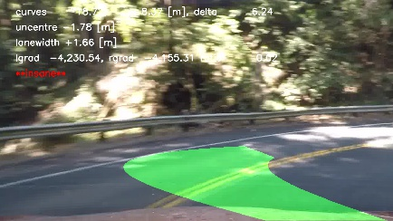

# Project 2: Advanced Line Finding

Starter version cloned from [this repo](https://github.com/udacity/CarND-Advanced-Lane-Lines).

## Quick References

- The main code is in file lanefinder.py
- Demonstration is in notebook adv_lane_lines.ipynb
- Output videos are prefixed with vout,
    - project video is vout_project.mp4,
    - challenge video is vout_challenge.mp4, and
    - harder challenge video is vout_harder.mp4

## Camera Calibration

Camera calibration was done with chessboard calibration images provided in the initial version of this project. They can be found in the `camera_cal` folder. Calibration steps are:

- find corners in calibration images with `cv2.findChessBoardCorners`, there are 9 per row and 6 per column
    - images with wrong number of corners are not used for calibration (there are several)
- found corners are put in correspondence with normalised coordinates in (x, y, z): ((0, 0, 0), (1, 0, 0), ...)
- compute calibration matrix, distortion coefficients, and rotation and translation matrices with `cv2.calibrateCamera`

These calibration steps are implemented as class method `calibrate` in the `LaneFinder` class (starts at line 60 in [./lanefinder.py]). This method is called upon class instantiation. This is done for project convenience; in real life, there is probably no need to calibrate the lane detector every time it is started.

With the calibration results, we can undistort an image taken by the camera. For instance, this original image:


when undistorted becomes:


Observe that the bottom row in the undistorted image is straighter than the one in the original image.

## Lane Detection Pipeline

Briefly, lane detection pipeline takes an image as input, and is ordered as follows:

- *undistort* image using previously found calibration matrices
- *prepare LAB and LUV* binary images
- *merge* above binary images
- *transform perspective* into bird-eye view
- *find lane pixels*
- *fit lane lines* into two 2nd order polynomials (for left and right lanes)
- *do sanity check* on the resulting line fits
- *draw lane overlay* on the undistorted image
- *return result*, the undistorted image with the lane overlay

This pipeline is encapsulated in the `fine_lane_lanes` class method of the `LaneFinder` class (starts at line 418, lanefinder.py). In addition to the input image, this method optionally takes two more parameters: `ignore_prior` and `verbose`, both are boolean. The former tells the method whether to ignore previous line fits in the *fit lane lines* step (e.g. from previous frame in the video). The latter tells the method whether to draw intermediate steps into pyplot figures and save them in image files. For video processing, both optional parameters should be set to `False`.

I shall now describe the pipeline steps in more details:

### Undistort

In this step, the previously calculated calibration matrices are used to undistort the input image with `cv2.undistort`. For instance, this input image:


is processed into:


### Prepare LAB and LUV Binary Images

LAB and LUV are two colour spaces

We use the B-channel from the LAB colour space to capture yellow lane lines and the L-channel of the LUV colour spaces to capture the white lane lines. Threshhold for the two channels are (150, 200) and (200, 255) respectively. For the challenge video, the LUV l-channel threshhold was changed to (176, 255) for good line detection in the earlier part of the video. This did not help with the part where there is a bridge overhead, however. Default values for threshholds are set in the constructor of the `LaneFinder` class (starts at line 8, lanefinder.py).

An example from LAB-space threshholding is shown below:


And an example from LUV-space is shown below:


We can see that the lane lanes are cleanly captured in the binary images. Most of the time, this will be the case, but not always. Implementation of these colour space transform and threshholding are done in the `prep_lab` and `prep_luv` methods, start at lines 171 and 152 of linefinder.py respectively.

### Merge Binary Images

Outputs from the previous two steps are merged with this logic:

```python
im_bin = imluv | imlab
```

See line 444, lanefinder.py.

### Transform Perspective

To facilitate line fit on a plane, the image is transformed in perspective to bird-eye view. This is done by first calculating a transformation matrix with `cv2.getPerspectiveTransform`, where the source and destination coordinates are as follow:

| Source        | Destination   |
|:-------------:|:-------------:|
| 1093, 719     | 1000, 720     |
| 724,  475     | 1000, 0       |
| 559,  475     |  300, 0       |
| 208,  719     |  300, 720     |

The source and destination coordinates are then reversed to calculate the reverse transformation matrix. In code, source and implementation are instance variables (line 38, lanefinder.py), and the perspective transform is executed during class initialisation (line 54, lanefinder.py).

This matrix is then used in `cv2.warpPerspective` to get a bird-eye view of the binary image from the previous step. An example is shown here:


### Find Lane Pixels

Finding lane pixels can be done in two ways: with or without prior, where prior means a previous result from this step, in form of coefficients of 2nd order polynomials. For the first image in a video, the *sans prior* variant is used, and for subsequent frames the *with prior* variant is used, unless its result does not pass sanity check.

**Find Lane Pixels Sans Prior**

Here, we take a histogram of the bird-eye perspective binary image, counting the number of bright pixels in each column over the bottom 2/3rd of the column. This histogram would have two peaks, one on the left and one on the right, corresponding to the left and right lane lines.

Then, the image is divided vertically into two sets of ten boxes of width 200 [px]. The first set starts at the bottom of the image where its x-centre is at the left peak of the histogram. The second set starts similarly but centred at the right peak of the histogram.

For each box, the bright pixels inside are appended into a list of coordinates for their respective side (left, right). If more than 50!!! bright pixels are detected, the next box up will be x-centred on the average x-coordinate of the detected bright pixels. In this way, when the line is curved, the boxes would be able to follow its curvature. When we have collected bright pixels from both sets of ten boxes, the two lists of points are used to fit two 2nd order polynomials `x = a*y^2 + b*y + c`, one for each lane.

In some cases, there can be no bright pixels found in either set of boxes. When that happens, in addition to the B-channel and L-channel used in the *Merge Binary Channel* step, we add Sobel edges. We find the Sobel-x and Sobel-y edges from the undistorted image in the original perspective. The Sobel-x is then scaled and threshholded with (6, 12). The resulting binary image is then transformed into the bird-eye view perspective, and OR-ed with the original binary image, so the equivalent logic becomes:

```python
im_bin = (imluv | imlab | im_sobelx) & im_sobelg
```
This backup logic is found starting in line 461 of linefinder.py.

We then repeat from the top of this step: find histogram, search for bright pixels, then fit a pair of 2nd order polynomials.

This step is implemented as `fit_lanes_sans_prior` class method (starts at line 215, lanefinder.py). An example output of this process is shown below:


**Find Lane Pixels With Prior**

If we have a pair of line fits from previous frame, instead of searching in a set of boxes, we look for the bright pixels within a margin from the previous line fits. Implemented as class method `fit_lanes_with_prior` class method (starts at line 309, lanefinder.py)

An example of the search space and result of this search with prior is shown below:


### Do Sanity Check

There are three criteria used to check if the line fits. They are:

- lane width must be close to 3.7 [m]

    Practically, `|lane_width-3.7|/3.7 < 0.25`

- difference of left and right radius of curvatures must be close to lane width

    Practically, `0.5 > |l_curve - r_curve|/lane_width < 10`. Generous margin must be given here as I could not make the radius calculation precise enough
       
- left and right lanes must be close to parallel

    Curves that look parallel on an interval have the same gradient at that interval. So, for this criteria, we take the first derivative of the line fit `2*a*y + b`, fill in the values of the last 10 `y` (from the bottom of the image, closest to the camera), and take their average as the gradient. If the values for left and right lanes are similar, then they are approximately parallel. Practically, `|l_grad - r_grad|/max(|l_grad|, |r_grad|) < 2`
    
For the line fit to be accepted, the line width criterion must pass, along with either of the latter two criteria. If the lane with was done with the *with prior* method, then if it does not pass the sanity check, another fit is done with the *sans prior* method. If *that* still does not pass the check, then the next frame will be fit without prior.

Sanity checks are implemented as `check_sanity` class method (starts at line 397, lanefinder.py).

For future improvement, we can also consider using previous *sane* fits to calculate an initial estimate of current fit and use that if current estimate does not pass checks. However, Kalman filter is in a future module and I am already late with this assignment...

### Draw Lane Overlay and Final Result

Finally, a polygon is drawn on the bird-eye view perspective using the two lane fits as boundaries. This polygon is then warped into the original camera perspective and overlaid on the undistorted image. This image forms the final output of the lane finding pipeline. Executed from line 521 in lanefinder.py.

An example is shown below:


## Applying Lane Detection Pipeline on Videos

To apply the pipeline on video image, simply use the `LaneFinder.find_lane_line` method with default parameters. It is best to turn off the verbose output when processing videos to avoid a clutter of intermediate results and writing and overwriting images to your disk.

Example of this application is in the demo notebook (adv_lane_lines.ipynb). Example video outputs are provided as vout_project.mp4, vout_challenge.mp4, and vout_harder.mp4. Only the first has a reasonably good result, though I think not at a level that is acceptable for an ADAS system.

## Discussion

We can observe from the project video output (vout_project.mp4), that the pipeline with the parameters given above works reasonable well in the conditions of the video. This condition is rather benign if we compare it to the challenge video and the harder challenge video, and the pipeline's performance degrades accordingly. Failing most of the time in the case of the harder challenge video.

In the remainder of this section I will discuss more details of the pipeline, possible improvements, and failure modes.

### More on the `LaneFinder` class

Parameters are declared with their default values in the `__init__` method. They can of course be changed after instantiation. An improvement would be to have a parameters file that one can edit, and a class method to re-read the file when new parameters are specified. For instance, a param.yaml for parameters and a `reload_param(parameter_file)` class method.

There are infrastructure for buffering results, the idea was to average the fit across several frames to reduce noise, and to facilitate other time-dependent pipeline, such as interpolating future curve fit from past coefficients. These features did not make it in time.

### Metric Conversion

Metre per pixel in x-direction is `3.7/700`, from regulation 3.7 [m] lane width, and 700 [px] lane width chosen for the perspective transform. In y-direction, the conversion is `3/158`, from regulation 3 [m] for dashed lane line and 158 [px] measured from one of the frame extracts.

### Sans Prior Process and Histogram initialisation

In the *sans prior* lane finding step, the centres of the bottom boxes are initialised at the peaks of a histogram counting bright pixels along the y-axis. In the lesson, the bottom half of the image was used to compute the histogram. This approach has a failure mode when the striped lane only appears on the top half of the bird-eye view image, giving bad initial box centre. In the project video, this hardly happens, because there is always a small line in-between the longer stripes. 

On the other hand, using the full height of the image when there is a strong curve in the lane would centre the bottom box at the average-x of the curve, and run the risk of the bottom box failing to capture any of the bottom lane pixels.

The solution chosen in this pipeline is to use the bottom 2/3rd of the image and check that the distance between the initial left and right boxes are within 10% of the 3.7 [m] regulation lane width. If it is not, then the histogram window is advanced by 1/3rd of the image and the process repeats. If we reach the top of the image without finding a box pair that fits the criterion, the whole height of the image is used. 

When called with `verbose=True`, the `fit_lanes_sans_prior` class method will print out the y-range of histogram window , the distance in pixel, and the ratio with regulation lane width. The histogram window itself is a parameter stored in the instance variable `hiswin`.

### Sobel Backup

In most cases, the colour threshholding is enough for finding lane lines. In fact, this is the case for the project video. In more difficult conditions, such as frame capture 0005 of the challenge video, one or more of the lane lines do not contribute bright pixels. In this case, the left line. However, Sobel can capture more of the line pixels, so we can augment the binary image with Sobel binary. There is still a drawback, as Sobel results are more noisy than colour threshholding, its contribution can confuse the box initialisation of the *sans prior* lane finding step. In the case of the challenge video, the contrast between the light and dark parts of the pavement in the middle of the lane risks getting a lane result that is half as wide as the actual lane (this will be caught by the sanity check, but the fallback would not give improvement).

An example when this method comes into play is shown in the series of images below. In this frame, the LUV and LAB threshholds do not yield pixels from both lane lines.

Input:


With initial binary image:


Sobel edges add more lane lines


Resulting in better line fits


Incidentally, this is also an example of the weakness of the previously described histogram initialisation process. The noise from the Sobel binary image shifts the initial box of the left-lane finder towards the centre.

### Miscellaneous Helper

Some frames are extracted from each of the videos (ranging from 1 frame per 2 seconds to 1 per 5) to be used for tuning the pipeline parameters. They are stored in `project_frames`, `challenge_frames`, and `harder_frames` directories.

Project-failing difficult frames (and surrounding) from the original submission are stored in the `difficult_project_frames` directory. There were four failure frames indicated in the original feedback, and frames surrounding those are labelled `frame_{a, b, c, d}*`, chronologically according to the video.

### Other Failure Modes

Very strong curves would easily fail this pipeline. Almost the entirety of the harder challenge video frames provide example for this.

For instance, frame capture 0041 is an example of this failure mode, compounded with one of the lane lines not visible.




### Avenues for Improvement

Temporal analysis would help in improving and stabilising the result. For instance:

- averaging curve coefficients from several sane frames . This must be balanced between vehicle speed and camera frame per second.
- extrapolate prior from several previous frames
- etc

Addition of other computer vision techniques, such as tracking features between sane frames and look for lane lines within a region of interest delineated by relevant features.

Machine learning techniques for lane detection. If supervised, a large volume of labelled data would be needed (look for open dataset). 
