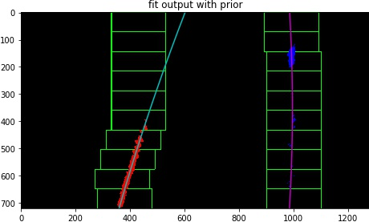

# Project 2: Advanced Line Finding

Starter version cloned from [this repo](https://github.com/udacity/CarND-Advanced-Lane-Lines).

## Quick References

- The main code is in file lanefinder.py
- Demonstration is in notebook adv_lane_lines.ipynb
- Output videos are prefixed with vout,
    - project video is vout_project.mp4,
    - challenge video is vout_challenge.mp4, and
    - harder challenge video is vout_harder.mp4

## Camera Calibration

Camera calibration was done with chessboard calibration images provided in the initial version of this project. They can be found in the `camera_cal` folder. Calibration steps are:

- find corners in calibration images with `cv2.findChessBoardCorners`, there are 9 per row and 6 per column
    - images with wrong number of corners are not used for calibration (there are several)
- found corners are put in correspondence with normalised coordinates in (x, y, z): ((0, 0, 0), (1, 0, 0), ...)
- compute calibration matrix, distortion coefficients, and rotation and translation matrices with `cv2.calibrateCamera`

These calibration steps are implemented as class method `calibrate` in the `LaneFinder` class (starts at line 60 in [./lanefinder.py]). This method is called upon class instantiation. This is done for project convenience; in real life, there is probably no need to calibrate the lane detector every time it is started.

With the calibration results, we can undistort an image taken by the camera. For instance, this original image:


when undistorted becomes:


Observe that the bottom row in the undistorted image is straighter than the one in the original image.

## Lane Detection Pipeline

Briefly, lane detection pipeline takes an image as input, and is ordered as follows:

- *undistort* image using previously found calibration matrices
- *prepare Sobel* binary images
- *prepare HSL* binary images
- *merge* above binary images
- *transform perspective* into bird-eye view
- *find lane pixels*
- *fit lane lines* into two 2nd order polynomials (for left and right lanes)
- *do sanity check* on the resulting line fits
- *draw lane overlay* on the undistorted image
- *return result*, the undistorted image with the lane overlay

This pipeline is encapsulated in the `fine_lane_lanes` class method of the `LaneFinder` class (starts at line 337, lanefinder.py). In addition to the input image, this method optionally takes two more parameters: `ignore_prior` and `verbose`, both are boolean. The former tells the method whether to ignore previous line fits in the *fit lane lines* step (e.g. from previous frame in the video). The latter tells the method whether to draw intermediate steps into pyplot figures and save them in image files. For video processing, both optional parameters should be set to `False`. 

I shall now describe the pipeline steps in more details:

### Undistort

In this step, the previously calculated calibration matrices are used to undistort the input image with `cv2.undistort`. For instance, this input image:


is processed into:


### Prepare Sobel

Lane lines often show edges against the road. These edges are detected with Sobel. Specifically, x-edges and gradients are used. The threshholds for Sobel-x are (16, 128), and the threshholds for gradient are (25, 65) [deg]. Implementation in class method `prep_sobel` (starts at line 90, lanefiner.py).

An example of this preparation is shown here:


### Prepare HLS

The Hue-Lightness-Saturation colour space also provides helpful input for the lane detection pipeline. Specifically, the lightness and saturation channels can be used to extract lane lines from the rest of the image.

In this implementation, the threshholds for saturation are (64, 255) and the ones for lightness are (175, 255). Implementation is in class method `prep_hls` (starts at line 140, lanefiner.py).

An example of this preparation is shown here:


### Merge Binary Images

Outputs from the previous two steps are merged with this logic:

```python
im_bin = (sobelx | saturation | lightness) & sobelgrad
```

See line 356, lanefinder.py.

### Transform Perspective

To facilitate line fit on a plane, the image is transformed in perspective to bird-eye view. This is done by first calculating a transformation matrix with `cv2.getPerspectiveTransform`, where the source and destination coordinates are as follow:

| Source        | Destination   |
|:-------------:|:-------------:|
| 1093, 719     | 1000, 720     |
| 724,  475     | 1000, 0       |
| 559,  475     |  300, 0       |
| 208,  719     |  300, 720     |

The source and destination coordinates are then reversed to calculate the reverse transformation matrix. In code, source and implementation are instance variables (line 35, lanefinder.py), and the perspective transform is executed in line 365, lanefinder.py.

This matrix is then used in `cv2.warpPerspective` to get a bird-eye view of the binary image from the previous step. An example is shown here:


### Find Lane Pixels

Finding lane pixels can be done in two ways: with or without prior, where prior means a previous result from this step, in form of coefficients of 2nd order polynomials. For the first image in a video, the sans prior variant is used, and for subsequent frames the with prior variant is used, unless its result doe not pass sanity check.

**Find Lane Pixels Sans Prior**

Here, we take a histogram of the bird-eye perspective binary image counting the number of bright pixels in each column over the bottom half of the column. This histogram would have two peaks, one on the left and one on the right, corresponding to the left and right lane lines.

Then, the image is divided vertically into two sets of ten boxes of width 200 [px]. The first set starts at the bottom of the image centred in the x-direction at the left peak of the histogram. The second set starts similarly but centred at the right peak of the histogram.

For each box, the bright pixels inside are appended into a list of coordinates for their respective side (left, right). If more than 50 bright pixels are detected, the next box up will be x-centred on the average x-coordinate of the detected bright pixels. When we have collected bright pixels from both sets of ten boxes, the two lists of points are used to fit two 2nd order polynomial `x = a*y^2 + b*y + c`, one for each lane.

Implemented as `fit_lanes_sans_prior` class method (starts at line 166, lanefiner.py).

An example output of this process is shown below:


**Find Lane Pixels With Prior**

If we have a pair of line fits from previous frame, instead of searching in a set of boxes, we look for the bright pixels within a margin from the previous line fits. Implemented as class method `fit_lanes_with_prior` class method (starts at line 228, lanefiner.py)

An example of the search space and result of this search with prior is shown below:



### Do Sanity Check

There are three criteria used to check if the line fits. Two of three must pass for the result to be accepted. They are:

- lane width must be close to 3.7 [m]

    Practically, `|lane_width-3.7|/3.7 < 0.5`

- difference of left and right radius of curvatures must be close to lane width

    Practically, `0.5 > |l_curve - r_curve|/lane_width < 20`. Generous margin must be given here as I could not make the radius calculation precise enough
       
- left and right lanes must be close to parallel

    Curves that look parallel on an interval have the same gradient at that interval. So, for this criteria, we take the first derivative of the line fit `2*a*y + b`, fill in the values of the last 10 `y` (from the bottom of the image, closest to the camera), and take their average as the gradient. If the values for left and right lanes are similar, then they are approximately parallel. Practically, `|l_grad - r_grad|/max(|l_grad|, |r_grad|) < 2`

If the lane with was done with the *with prior* method, then if it does not pass the sanity check, another fit is done with the *sans prior* method. If *that* still does not pass the check, then the next frame will be fit without prior.

Sanity checks are implemented as `check_sanity` class method (starts at line 316, lanefiner.py).

For future improvement, we can also consider using previous *sane* fits to calculate an initial estimate of current fit and use that if current estimate does not pass checks. However, Kalman filter is in a future module and I am already late with this assignment...

### Draw Lane Overlay and Final Result

Finally, a polygon is drawn on the bird-eye view perspective using the two lane fits as boundaries. This polygon is then warped into the original camera perspective and overlaid on the undistorted image. This image forms the final output of the lane finding pipeline. Executed from line 422 in lanefinder.py.

An example is shown below:


## Applying Lane Detection Pipeline on Videos

To apply the pipeline on video image, simply use the `LaneFinder.find_lane_line` method with default parameters. It is best to turn off the verbose output when processing videos to avoid a clutter of intermediate results and writing and overwriting images to your disk.

Example of this application is in the demo notebook (adv_lane_lines.ipynb). Example video outputs are provided as vout_project.mp4, vout_challenge.mp4, and vout_harder.mp4. Only the first has a reasonably good result, though I think not at a level that is acceptable for an ADAS system.

## More on the `LaneFinder` class

Parameters are declared with their default values in the `__init__` method. They can of course be changed after instantiation. An improvement would be to have a parameters file that one can edit, and a class method to re-read the file when new parameters are specified.

There are infrastructure for buffering results, the idea was to average the fit across several frames to reduce noise. These features did not make it in time.

## Metric Conversion

Metre per pixel in x-direction is `3.7/700`, from regulation 3.7 [m] lane width, and 700 [px] lane width chosen for the perspective transform. In y-direction, the conversion is `3/158`, from regulation 3 [m] for dashed lane line and 158 [px] measured from one of the frame extracts.

## Miscellaneous

Some frames are extracted from each of the videos (ranging from 1 frame per 2 seconds to 1 per 5) to be used for tuning the pipeline parameters. They are stored in `project_frames`, `challenge_frames`, and `harder_frames` directories.
